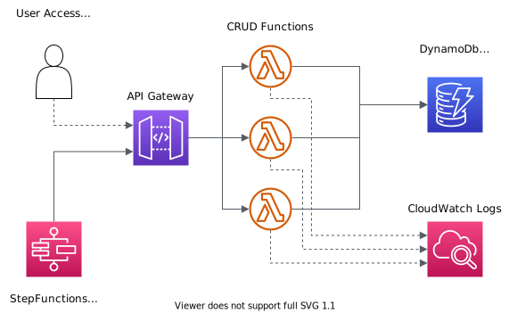

# AWS CDK and TypeScript Lambda Function Demo

This project is designed for testing AWS Lambda PowerTools for logging to CloudWatch and X-Ray.

It demonstrates:
- Use of simple CDK shared constructs to standardise resources
- Using TypeScript Lambda PowerTools for logging and metrics
- Creating CloudWatch Insights queries for filtering Lambda logs
- Creating a CloudWatch Dashboard for displaying metrics for a simple serverless app

All of the resources are created using CDK and can be simply deployed to a test account.

More detail is covered in the Medium articles here:
- [Custom Constructs](https://medium.com/p/758f99ae94a6)

&nbsp;

## Overview

The project deploys a simple demo application with the following components:

&nbsp;



&nbsp;

The "application" provides an API for creating items of a particular colour (Red or Blue), with methods to create, update, delete and read the item table.

You can use the API methods to manually create and modify items but it is not really necessary.

The project includes a StepFunction that will create random data for testing. By default it will run 20 iterations where it:
- Creates an item with random options
- Tries to update the item with more random options
- If the update fails due to invalid options then it will delete the item
- If the update succeeds then it will read the item

This creates enough logs and items to be useful in reviewing in CloudWatch.

&nbsp;

## Setup

There are no prerequisites in your AWS Account. Assuming you already have CDK installed, setup requires:
- clone the repo
- `npm ci` to install required modules
- `npm run build` to build the Lambda layer that includes the PowerTools and other required modules
- `cdk deploy --all` to deploy to your default AWS CLI environment

You can hard-code an environment (Account + Region) in the `bin/deploy.ts` file instead of using the CLI default if required.

It is not required, but you can modify some options using the `config/index.ts` file, including the service name and log level.

&nbsp;

## Creating Test Data

Run the StepFunction once or twice to create logs for review. You can run manually from the console or from the command line after deployment.

The StepFunction will ignore any input. By default it will run 20 iterations (hard-coded in the StepFunction stack to keep things simple).

Note the CLI command to run the StepFunction is output in CloudFormation on deployment. It will look something like this:

``` bash
aws stepfunctions start-execution --state-machine-arn "arn:aws:states:ap-southeast-1:123456789012:stateMachine:TestLogDemoFunctions"
```

The response will include the StepFunction execution name, which is used as the `correlationId` for the test batch:

``` json
{
    "executionArn": "arn:aws:states:ap-southeast-1:123456789012:execution:TestLogDemoFunctions:<exection name / correlation id>",
    "startDate": "2022-10-25T19:23:18.813000+07:00"
}
```
We can filter logs and X-Ray traces in the CloudWatch console to view results, or use the Get Item method below to verify the items are created.

&nbsp;

## Reviewing Results

Open CloudWatch in the console after creating some test data (actually wait a minute or two - CloudWatch logging is async).

**Dashboard**

Under `Dashboards` look for `ToolsDemo_Dashboard`. You will see a selection of key stats for the application in the dashboard.

**Logs Insights**

Under `Log Insights` look for the `Queries` link on the right. You will see four saved queries:
- `ToolsDemo_ErrorLevel` and `ToolsDemo_WarnLevel`. If you select and run them you will see filtered lists of the Lambda error logs.
- `ToolsDemo_ErrorLevel_CorrelationId` and `ToolsDemo_WarnLevel_CorrelationId`. After selecting the query you need to manually edit it to add a `correlationId` for filtering.

**X-Ray**

Using the new X-Ray traces section in the CloudWatch console:
- Select the `Service Map` or `Traces`
- Select the `TOOLSDEMO` group in the *Filter by X-Ray Group* box
- You can also create filters for `correlationId` in the Traces screen. Enter the query like `annotation.correlationId = "8de08530-0df0-4661-aa6e-e1ae7accde31"`. Note you will only see one trace for each correlationId/StepFunction batch, and it will include all of the Lambda and other AWS service calls.

&nbsp;

## API Resources

If you are keen you can test the API manually.

Application logic:
- We can set items to be `isRed` or `isBlue`
- If we do not select a colour, or we select both `isRed` and `isBlue` then a `400` error is returned.
- To make our Dashboard more interesting, we write metrics with colour `Black` if no colour is selected, and `Purple` if both `isRed` and `isBlue` are selected.
- We can choose to throw an internal error to create some error logs using the `throwError` flag
- Or we can make it all random by setting the `surpriseMe` flag

Note that the API URL is output in CloudFormation - in the CLI when deploying and in the CloudFormation stack outputs in the console.

### Create Item
---

Create a user for the service.

**Path** : `/`

**Method** : `POST`

**Example:**

``` bash
curl --location --request POST 'https://my-api-url' \
--header 'Content-Type: application/json' \
--data-raw '{
    "correlationId": "c26cbd02-147a-4ff9-aebf-84b9dca581c0",
    "isRed": false,
    "isBlue": false,
    "throwError": false,
    "surpriseMe": true
}'
```

### Update Item
---

Update an existing item.

**Path** : `/`

**Method** : `PUT`

**Example:**

``` bash
curl --location --request PUT 'https://my-api-url' \
--header 'Content-Type: application/json' \
--data-raw '{
    "correlationId": "c26cbd02-147a-4ff9-aebf-84b9dca581c0",
    "itemId": "guid for existing item",
    "isRed": false,
    "isBlue": false,
    "throwError": false,
    "surpriseMe": true
}'
```

### Delete Item
---

Delete an existing item.

**Path** : `/`

**Method** : `DELETE`

**Example:**

``` bash
curl --location --request DELETE 'https://my-api-url' \
--header 'Content-Type: application/json' \
--data-raw '{
    "correlationId": "c26cbd02-147a-4ff9-aebf-84b9dca581c0",
    "itemId": "guid for existing item",
    "throwError": false
}'
```

### Get Item
---

Get an existing item or items. No query params will return all items.

**Path** : `/`

**Method** : `GET`

**Example:**

Get an item:

``` bash
curl --location --request GET 'https://my-api-url?itemId=6756733c-173e-4fe2-b1d2-0b8bb51f98fd'
```

Get all items for a batch:

``` bash
curl --location --request GET 'https://my-api-url?correlationId=c26cbd02-147a-4ff9-aebf-84b9dca581c0'
```

Get all items:

``` bash
curl --location --request GET 'https://my-api-url'
```

&nbsp;

## Custom Constructs

The API, Lambda and DynamoDb resources are included as custom constructs in the `lib/constructs` folder.

This allows for a consistent configuration in our application by configuring a set of defaults for each resource type.

Of particular interest here is the `custom-nodejs-function`. Review the code there to see how PowerTools are configured in the function, and how we export a standard set of widgets for use in the Dashboard.

The `custom-api` and `custom-table` constructs also export Dashboard widgets for DynamoDb and API Gateway.

&nbsp;

## Costs and Cleanup

All of the resources deployed and used for testing will be well under the normal AWS free tiers.

CloudWatch has a bewildering array of prices for the various components that I'm not going into here. It is only important at high volume.

To clean up run `cdk destroy --all` or just delete the CloudFormation stacks.
